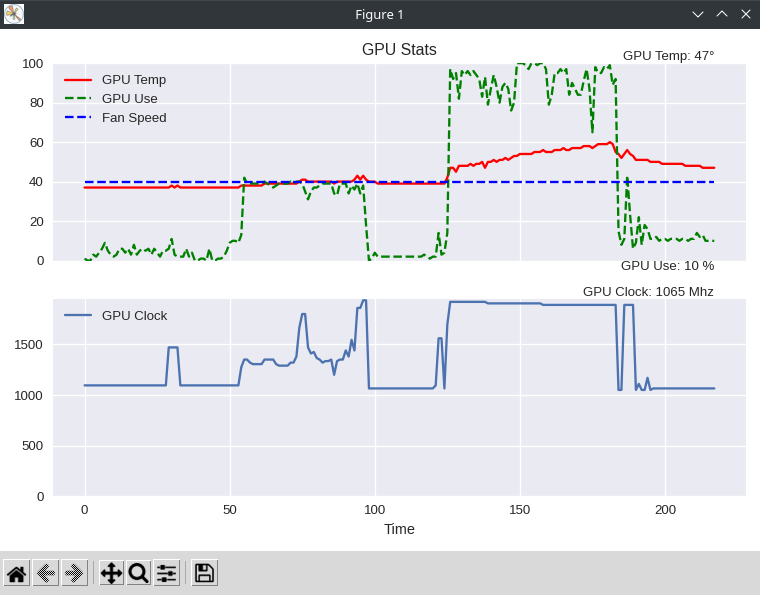
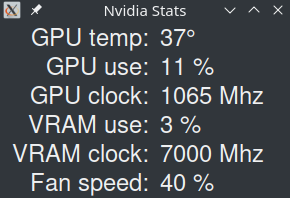

# nvidia-stats

Nvidia GPU stat reporting app for Linux.

## Table of Contents

- [About](#about)
- [Getting Started](#getting-started)
  - [Prerequisites](#prerequisites)
  - [Installing](#installing)
- [How It Works](#how-it-works)

## About

NvidiaStats is a command line GPU stat reporting application written for use in a Linux-based operating system running the Xorg display server with proprietary Nvidia drivers. Currently, it will report GPU utilization, GPU clock, GPU temperature, VRAM utilization, VRAM clock, and fan speed.

## Getting Started

### Prerequisites

- Linux-based operating system
  - Xorg display server
- Nvidia GPU running proprietary nvidia drivers
- Python 3.6+
- Python dependencies:
  - matplotlib
  - pandas

### Installing

1) You can check that you are using prorietary nvidia drivers compatible with the NvidiaStats:
   - `ixni -G`
   - Check your driver info to make sure it is listed as `nvidia`
2) Clone the repository:
   - `git clone https://github.com/cw417/nvidia-stats`
3) Change into the new directory:
   - `cd nvidia-stats`
4) Create a virtual environment to run `nvidia-stats` inside:
   - `python3 -m venv env`
   - `source env/bin/activate`
5) Install the necessary python dependencies
   - `pip3 install matplotlib pandas`
6) Run NvidiaStats: 
   - `python3 run.py`

## How It Works

- GPU stats are obtained via the subprocess module running the `nvidia-smi -q` command with the specified stat output option
- Output from the subprocess module is parsed via regex
- The regex match output is written to a CSV file, as well as formatted and printed to the command line
- Matplotlib reads the CSV file for updates, and plots the live output on a graph
- Tkinter is used to create a GUI to display stats and updates in real time